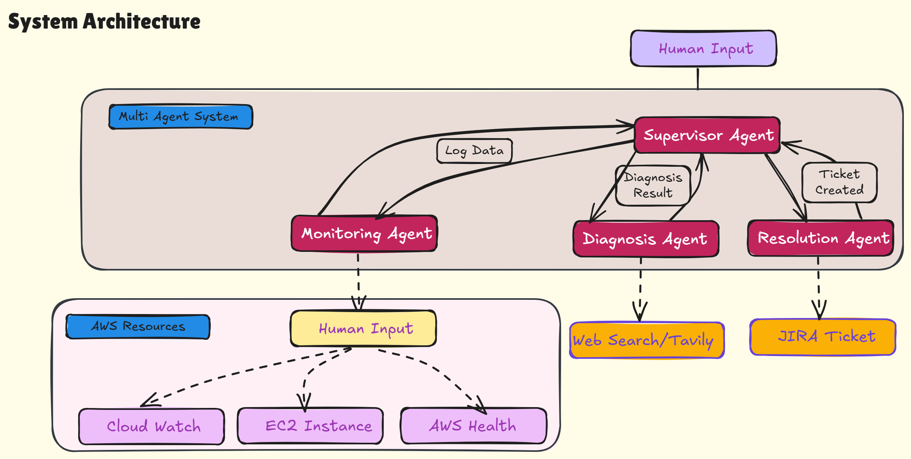

# Autonomous Multi-Agent System for AWS Incident Response

> A production-grade agentic workflow on Amazon Bedrock that detects, diagnoses, and resolves AWS incidents — and creates JIRA tickets — without a human in the loop.

## Overview

This project implements a supervisor-orchestrated multi-agent system that monitors AWS services, diagnoses incidents via RAG over a self-learning knowledge base, escalates to web search for novel problems, and autonomously creates detailed JIRA tickets with remediation steps.

The knowledge base grows with every resolved incident — month one, most incidents require web search; by month three, the majority match something already in memory.

📖 **Read the full walkthrough:** [Your Substack URL / AWS Builder Center URL]

## How it works

The system runs four specialized agents coordinated by an explicit state machine:

| Agent | Role | Model |
|-------|------|-------|
| **Supervisor** | Routes between agents, tracks workflow state | Nova Micro |
| **Monitoring** | Pulls CloudWatch/CloudTrail logs, detects anomalies | Nova Micro |
| **Diagnosis** | RAG over past incidents → Tavily web search fallback | Nova Pro |
| **Resolution** | Creates JIRA tickets, sends push notifications | Nova Micro |

Models are chosen per agent based on cognitive load — reasoning-heavy work gets Nova Pro, deterministic work gets Nova Micro.

## Key features

- **Continuous AWS monitoring** — CloudWatch and CloudTrail across IAM, S3, EC2, Bedrock
- **RAG-powered diagnosis** — vector search over a growing incident memory (Chroma + HuggingFace embeddings)
- **Web search fallback** — Tavily API invoked for novel incidents
- **Self-learning memory** — every resolution is written back to the knowledge base
- **Guardrailed resolution** — explicit skip list prevents "everything is fine" tickets
- **Full observability** — LangSmith traces every agent invocation and tool call

## Tech stack

- **Amazon Bedrock** (Claude, Amazon Nova Pro, Amazon Nova Micro)
- **LangGraph** — multi-agent state machine orchestration
- **LangChain** — ReAct agent primitives
- **Chroma** + **HuggingFace sentence-transformers** — vector store
- **Tavily API** — web search tool
- **boto3** — CloudWatch, CloudTrail, AWS Health
- **atlassian-python-api** — JIRA integration
- **LangSmith** — tracing and observability
- **Streamlit** — demo UI

## Repository structure
